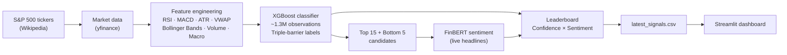

# S&P 500 AI Stock Screener

[](https://ko-fi.com/ethanbuckley)

A two-stage stock screening pipeline that combines an XGBoost gradient-boosting classifier with FinBERT financial sentiment analysis to identify long and short candidates across the S&P 500.

Built as an independent project applying quantitative finance techniques alongside my Physics and Physical Chemistry degree at UCL.

---

## Live Demo

**[Launch the dashboard →](https://your-app-name.streamlit.app)** *(link to be updated after deployment)*

---

## Architecture



---

## How It Works

### Stage 1 — XGBoost Classifier

An XGBoost binary classifier is trained on 10+ years of daily OHLCV data across all S&P 500 constituents. The target variable uses **triple-barrier labelling**: for each trading day, the model checks whether the stock hits a +4% take-profit or a −4% stop-loss within the next 5 trading days. This is preferable to simple forward returns because it more closely reflects how a real trade with risk management plays out.

Features fall into five groups:

| Group | Features |
|---|---|
| Momentum | RSI, MACD, lagged returns |
| Volatility | Bollinger Band position, ATR ratio |
| Volume | Volume surge, VWAP deviation |
| Market context | SPY, QQQ, SMH returns; VIX, 10Y Treasury |
| Relative performance | Stock return vs each macro benchmark |

One model is trained across all tickers rather than one per stock, so the classifier learns patterns that generalise across the market rather than fitting to individual ticker history.

### Stage 2 — FinBERT Sentiment Analysis

The top 15 and bottom 5 candidates by XGBoost confidence are passed to **FinBERT** ([ProsusAI/finbert](https://huggingface.co/ProsusAI/finbert)), a BERT model fine-tuned on financial news, analyst reports, and earnings call transcripts. Live news headlines are fetched for each candidate and scored. The final output combines both signals: a bullish confluence requires high model confidence *and* positive news sentiment.

---

## Validation

The model is trained on approximately **1.3 million daily observations** (all S&P 500 constituents, 2015 to present). The labelling approach is walk-forward safe: the triple-barrier target is computed only using future highs and lows, with no lookahead into model predictions. The XGBoost model uses regularisation parameters (`subsample=0.8`, `colsample_bytree=0.8`, `max_depth=5`) to limit overfitting.

Interpretation thresholds:

| Signal | Condition |
|---|---|
| Long candidate | Confidence > 55% **and** Sentiment > 0 |
| Short candidate | Confidence < 45% **and** Sentiment < 0 |

---

## Tech Stack

| Component | Technology |
|---|---|
| ML classifier | XGBoost |
| NLP sentiment | FinBERT (ProsusAI/finbert, HuggingFace Transformers) |
| Data acquisition | yfinance, requests |
| Feature engineering | pandas, NumPy |
| Dashboard | Streamlit, Plotly |
| Universe | S&P 500 (scraped live from Wikipedia) |

---

## Project Structure

```
stockmarketS-P/
├── screener.py           # Full pipeline (data → features → XGBoost → FinBERT → console output)
├── generate_signals.py   # Scheduled runner: calls screener.py and writes data/latest_signals.csv
├── app.py                # Streamlit dashboard — reads latest_signals.csv only, no heavy ML deps
├── data/
│   └── latest_signals.csv  # Pre-computed output committed to the repo for the live demo
├── requirements.txt      # App-only dependencies (streamlit, pandas, plotly)
└── README.md
```

**`screener.py`** — the full two-stage pipeline. Run this directly to see live console output.

**`generate_signals.py`** — thin wrapper around `screener.py` that additionally writes `data/latest_signals.csv`. Run this locally on a regular cadence (e.g. weekly) and commit the output file so the dashboard always reflects recent signals.

**`app.py`** — the Streamlit dashboard. Reads only the CSV; does not import XGBoost, Transformers, or PyTorch, so it runs on Streamlit Community Cloud's free tier without memory issues.

---

## Running Locally

### Full pipeline (data fetching + model training + FinBERT)

```bash
git clone https://github.com/ethanbuckley/stockmarketS-P.git
cd stockmarketS-P
pip install yfinance xgboost transformers torch pandas numpy requests lxml scikit-learn
python screener.py          # live console output
python generate_signals.py  # also writes data/latest_signals.csv
```

On first run, FinBERT downloads automatically (~400 MB). Subsequent runs load from cache.
The full pipeline takes roughly 15–30 minutes depending on internet speed and hardware.

### Dashboard only

```bash
pip install -r requirements.txt
streamlit run app.py
```

The dashboard reads `data/latest_signals.csv`. If that file is missing, run
`generate_signals.py` first (or use the committed sample file).

---

## Disclaimer

This project is for educational and research purposes only. It does not constitute financial advice. Past model performance does not guarantee future results.

---

## Author

Ethan Buckley, MSci Natural Sciences (Physics and Physical Chemistry), UCL
[ethan.buckley.24@ucl.ac.uk](mailto:ethan.buckley.24@ucl.ac.uk)
