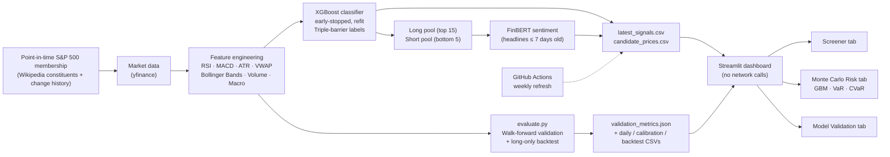

# S&P 500 stock screener

[](https://github.com/ethanbuckley/stockmarketS-P/actions/workflows/ci.yml)

A two-stage pipeline that ranks long and short candidates across the S&P 500: an XGBoost classifier does the ranking, and FinBERT scores news sentiment on the shortlist. The classifier is walk-forward validated against a point-in-time universe, backtested after costs, and compared with a model-free baseline. The dashboard includes a Monte Carlo portfolio-risk simulator.

**Read the [Validation](#validation) section before the architecture.** The headline finding is negative: the classifier's out-of-sample ranking is fully explained by stock volatility. Sorting each day by the 14-day ATR ratio, with no model at all, matches its per-day AUC and precision@15 and beats its backtest. The repository is kept honest about that rather than tuned around it.

Built as an independent project applying quantitative finance techniques alongside my Physics and Physical Chemistry degree at UCL.

---

## Live Demo

**[Launch the dashboard →](https://stockmarkets-p-cngwhp4eigfgpq5xphgwng.streamlit.app)**

---

## Architecture


```mermaid
flowchart LR
    A["Point-in-time S&P 500 membership\n(Wikipedia constituents + change history)"] --> B["Market data\n(yfinance)"]
    B --> C["Feature engineering\nRSI · MACD · ATR · VWAP\nBollinger Bands · Volume · Macro"]
    C --> D["XGBoost classifier\nearly-stopped, refit\nTriple-barrier labels"]
    D --> E["Long pool (top 15)\nShort pool (bottom 5)"]
    E --> F["FinBERT sentiment\n(headlines ≤ 7 days old)"]
    D & F --> G["latest_signals.csv\ncandidate_prices.csv"]
    C --> V["evaluate.py\nWalk-forward validation\n+ long-only backtest"]
    V --> M["validation_metrics.json\n+ daily / calibration / backtest CSVs"]
    W["GitHub Actions\nweekly refresh"] -.-> G
    G --> H["Streamlit dashboard\n(no network calls)"]
    M --> H
    H --> I["Screener tab"]
    H --> J["Monte Carlo Risk tab\nGBM · VaR · CVaR"]
    H --> K["Model Validation tab"]
```

---

## How It Works

### Stage 1: XGBoost classifier

An XGBoost binary classifier is trained on daily OHLCV data for a point-in-time S&P 500 universe from 2015 to the present. Current members enter the panel from the date they joined the index (the Wikipedia constituents table records this). Companies removed from the index since 2015 are included up to their removal date, reconstructed from Wikipedia's [change history](https://en.wikipedia.org/wiki/Historical_components_of_the_S%26P_500), wherever Yahoo still serves their prices; they are trained and tested on but can never be today's candidates. Indicator windows are warmed up on each stock's earlier prices, which did exist. The target variable uses **triple-barrier labelling**: for each trading day, the label asks whether the stock hits a +4% take-profit before a −4% stop-loss within the next 5 trading days. This is preferable to simple forward returns because it reflects how a real trade with risk management plays out. Days where neither barrier is hit, or where both are hit on the same bar, are conservatively labelled 0.

Features fall into five groups (22 columns in total):

| Group                | Features                                  |
| -------------------- | ----------------------------------------- |
| Momentum             | RSI, MACD, lagged returns                 |
| Volatility           | Bollinger Band position, ATR ratio        |
| Volume               | Volume surge, VWAP deviation              |
| Market context       | SPY, QQQ, SMH returns; VIX, 10Y Treasury  |
| Relative performance | Stock return vs each macro benchmark      |

One model is trained across all tickers rather than one per stock, so the classifier learns patterns that generalise across the market rather than fitting to individual ticker history. What it has in fact learned is documented under Validation: its ranking is indistinguishable from a volatility sort. The number of boosting rounds is not fixed: `train_model` holds out the most recent 10% of training dates (with the same 5-day purge the validation uses), early-stops against that slice, then refits on all training rows with the chosen count. All tunable settings live in `config.py`.

### Stage 2: FinBERT sentiment analysis

The top 15 (long pool) and bottom 5 (short pool) candidates by XGBoost confidence are passed to **FinBERT** ([ProsusAI/finbert](https://huggingface.co/ProsusAI/finbert)), a BERT model fine-tuned on financial news, analyst reports, and earnings call transcripts. Headlines published within the last 7 days are fetched for each candidate and scored; positive, negative and neutral labels map to +score, −score and 0, and the final sentiment is the mean over up to 10 headlines. A blank sentiment score means no recent news was available, which is deliberately distinct from a neutral score of 0.

Signals are rank-based. A long candidate is a stock in the long pool with positive sentiment; a short candidate is one in the short pool with negative sentiment. There is no absolute confidence cut-off: the label is positive for only about a quarter to a third of stock-days, so a well-calibrated probability near 50% is already roughly twice the base rate, and a 55% cut-off (an earlier version of this project) was effectively never reached.

**The sentiment filter is not validated.** There is no free archive of past headlines, so nothing here measures whether "long pool and positive news" beats "long pool" alone. To make that measurable, every run appends its leaderboard to `data/signal_history.csv`; once enough weekly runs have resolved (each needs 5 trading days), the filter can be scored against the outcomes. Until then, treat sentiment as context, not as a tested signal.

### Monte Carlo portfolio risk

The dashboard's risk tab simulates thousands of future paths for an equal-weighted portfolio of screener candidates using geometric Brownian motion calibrated to one year of historical daily log-returns. That year of adjusted closes is written next to the signals as `data/candidate_prices.csv`, so the deployed app never calls Yahoo. Co-movement between assets is preserved by Cholesky-decomposing the empirical correlation matrix and correlating the random shocks accordingly. The tab reports 95% VaR and CVaR (expected shortfall), the probability of loss, a fan chart of simulated paths, and the distribution of final portfolio values, together with the model's assumptions and their limitations.

---

## Validation

The classifier is evaluated with **expanding-window walk-forward validation** (`evaluate.py`): 7 folds with calendar-year test blocks from 2020 to a partial 2026, each retraining the production model from scratch on all data up to that fold, including the early-stopping choice of tree count, which uses only that fold's training data. Because the label looks 5 trading days ahead, the last 5 trading days before each test block are purged from training; features are strictly backward-looking, which an automated causality check enforces. Two leakage canaries back this up. Training fold 1 on fully permuted labels gives a mean per-day AUC of 0.498 (range 0.486 to 0.508 over five permutations) against 0.592 with the real labels. Removing the purge gives the unpurged model no advantage on the first ten test days (0.588 against 0.592), so the boundary leakage the purge exists to remove is not detectable here.

Headline out-of-sample results (2026-09-11 data snapshot; 503 current members plus 124 of 242 former members; 794,700 test rows over 1,659 test days; all figures computed by `evaluate.py` and stored in [`data/validation_metrics.json`](data/validation_metrics.json)):

| Metric                              | XGBoost model                                   | Volatility-only baseline (rank by ATR ratio) |
| ----------------------------------- | ----------------------------------------------- | -------------------------------------------- |
| ROC AUC (pooled)                    | 0.660                                           | n/a                                          |
| Mean per-day AUC (ranking skill)    | 0.643 (95% CI 0.633 to 0.652)                  | 0.642 (95% CI 0.633 to 0.651)               |
| Brier score                         | 0.193                                           | n/a                                          |
| Precision@top-15, daily mean        | 46.0% vs a 28.8% daily base rate                | 46.1%                                        |
| Excess over base rate               | +17.1 pts (95% CI +15.8 to +18.5)               | +17.2 pts (95% CI +15.7 to +18.7)            |
| Days the top-15 beats the base rate | 77.0% of 1,659 test days                        | 76.8%                                        |
| Top-decile lift                     | 1.75x mean (1.64x median)                       | 1.76x mean                                   |
| Bottom-5 positive rate              | 10.8% vs the 28.8% base rate                    | n/a                                          |

Precision@top-15 mirrors deployment: each test day, rank the whole cross-section by predicted probability, take the top 15, and measure the fraction whose take-profit barrier was hit first. Per fold (trees = boosting rounds chosen by early stopping inside that fold's training data; CI = moving-block bootstrap on the daily excess):

| Test year      | Trees | ROC AUC | Per-day AUC | Precision@15 | Base rate | Excess 95% CI (pts) |
| -------------- | ----- | ------- | ----------- | ------------ | --------- | ------------------- |
| 2020           |    80 | 0.647   | 0.592       | 47.0%        | 36.6%     | +6.7 to +13.9 |
| 2021           |    60 | 0.681   | 0.643       | 45.8%        | 26.0%     | +15.4 to +23.8 |
| 2022           |    76 | 0.627   | 0.637       | 45.9%        | 32.5%     | +10.6 to +16.3 |
| 2023           |    48 | 0.654   | 0.665       | 44.8%        | 24.5%     | +16.8 to +23.7 |
| 2024           |    42 | 0.655   | 0.662       | 44.2%        | 23.8%     | +16.5 to +23.8 |
| 2025           |    37 | 0.654   | 0.652       | 46.9%        | 27.4%     | +15.9 to +22.7 |
| 2026 (partial) |    59 | 0.622   | 0.650       | 48.0%        | 32.6%     | +9.9 to +20.7 |

The ranking beats the base rate in every regime tested (the 2020 crash, the 2022 bear market, and the recoveries either side). So does the baseline. These are classifier-quality metrics on a point-in-time universe that still lacks 118 removed companies whose prices Yahoo no longer serves, so hit rates remain somewhat optimistic (see Limitations). The dashboard's Model Validation tab renders these artefacts, including per-fold confidence intervals, per-day dispersion and the calibration curve.

### Ranking skill versus regime skill

Pooled ROC AUC mixes two abilities: telling which *days* will have many barrier hits (the macro features carry the volatility regime) and ranking *stocks within a day*. Only the second is useful to a screener that picks 15 names every day. The **mean per-day AUC** isolates it: compute the AUC inside each test day's cross-section and average. For the model it is 0.643. A model trained on labels permuted *within* each day, which can learn nothing about ranking, still reaches a pooled AUC near 0.59 from the regime channel alone, which is why pooled AUC is not the number to quote.

### The volatility baseline

The label, "+4% before −4% within 5 days, otherwise 0", is mechanically likelier for volatile stocks: they hit *some* barrier, while quiet stocks fall into the "neither" bucket that is labelled 0. So the fair question is not whether the model beats the base rate but whether it beats sorting by volatility. `evaluate.py` scores exactly that: each test day ranked by the 14-day ATR ratio, no model, through the same metric and backtest code.

It matches the model. Per-day AUC 0.642 against 0.643; precision@15 46.1% against 46.0%. Removing ATR from the model's features drops its fold-1 to fold-3 per-day AUC from about 0.64 to about 0.60, and the within-day rank correlation between the model's scores and the label, after controlling for ATR, is 0.02 to 0.03. What the classifier has learned is, to a very good approximation, "volatile stocks hit barriers". That is true and it is not tradeable insight.

### Portfolio backtest

`evaluate.py` also turns the same out-of-sample predictions into a stylised long-only book: each test day's top 15 form an equal-weighted tranche held 5 trading days close-to-close, five tranches overlap so a fifth of the book rolls daily, and every entry and exit is charged 10 basis points. It is compared with an equal-weighted, cost-free portfolio of the whole eligible cross-section (the universe the ranking chooses from) and with SPY over the same window.

| Series (test window 2020 to 2026) | Ann. return | Ann. vol | Sharpe (rf=0) | Max drawdown |
| ------------------------------------ | ----------- | -------- | ------------- | ------------ |
| Top-15 book, gross                   | +23.5%      | 38%      | 0.74          | -44.9%       |
| Top-15 book, net of 10 bps per side  | +11.7%      | 38%      | 0.48          | -49.1%       |
| Same book from the ATR-only ranking  | +14.4%      | 47%      | 0.52          | -64.2%       |
| Universe equal-weight, no costs      | +12.9%      | 21%      | 0.68          | -40.0%       |
| SPY                                  | +15.9%      | 20%      | 0.84          | -33.7%       |

Gross of costs the book outruns its universe by about 11 points a year, at nearly twice the volatility. After costs it trails both the equal-weighted universe and SPY, and the volatility-only book does better than it. Daily returns for every series are in [`data/backtest_daily.csv`](data/backtest_daily.csv).

This is classifier output pushed through a fixed rule, not a strategy: no barrier exits, no position sizing, no slippage or capacity model, and the same survivorship bias as the metrics above. A fifth of the book turning over every day costs about 12 points a year at 10 bps per side, which is the gap between the gross and net lines.

Signal definitions used by the screener and dashboard:

| Signal          | Condition                                              |
| --------------- | ------------------------------------------------------ |
| Long candidate  | In the long pool (top 15 by confidence) **and** Sentiment > 0 |
| Short candidate | In the short pool (bottom 5 by confidence) **and** Sentiment < 0 |

---

## Limitations

Read these before quoting any number above; the validation caveats among them also ship inside `data/validation_metrics.json`, so the dashboard cannot display the metrics without them.

- **Survivorship bias.** Membership is point-in-time by symbol: current members from their join date, and companies removed since 2015 up to their removal date where Yahoo still has prices (124 of 242 removed tickers). The remaining removed companies, mostly acquired or delisted, are absent, and that residual still inflates measured hit rates. Symbol-based matching also means a company whose ticker changed while in the index is covered under its current symbol only.
- **The backtest is stylised.** Close-to-close 5-day holds at 10 bps per side, equal weights, no barrier exits, no slippage or capacity model. It shows whether the ranking's edge survives a plausible cost, not what a fund would earn.
- **Data quality.** Prices are a single yfinance snapshot with auto-adjustment applied at download time; adjusted history can differ from what was observable in real time, and delisted tickers are absent. Prices are forward-filled across a ticker's non-trading days so macro series align; volume is not, so those days carry no training row.
- **Label conventions.** "Neither barrier hit" and "both barriers hit on the same bar" both map to label 0, so the class balance depends on the volatility regime (daily base rates ranged from 23.5% to 36.1% across test years). A low predicted probability is therefore not a symmetric short signal.
- **Overlapping labels.** Consecutive test days share 5-day label windows and are not independent; the confidence interval above uses a moving-block bootstrap with block length 5.
- **Sentiment coverage and value.** Some candidates have no headlines from the last 7 days; their sentiment is blank, not zero. The sentiment filter itself is unvalidated (see above).
- **Risk-tab assumptions.** Geometric Brownian motion assumes constant drift and volatility, normal shocks and static correlations, all violated by real equity returns (correlations in particular spike in crashes). The in-app methodology notes cover this in detail.

---

## Tech Stack

| Component           | Technology                                        |
| ------------------- | ------------------------------------------------- |
| ML classifier       | XGBoost                                           |
| NLP sentiment       | FinBERT (ProsusAI/finbert, HuggingFace Transformers) |
| Validation          | Walk-forward evaluation (scikit-learn metrics)    |
| Risk simulation     | NumPy (geometric Brownian motion, Cholesky)       |
| Data acquisition    | yfinance, requests (pipeline only)                |
| Feature engineering | pandas, NumPy                                     |
| Dashboard           | Streamlit, Plotly; reads committed files, no network |
| Universe            | Point-in-time S&P 500 (Wikipedia constituents + change history) |
| Reproducibility     | uv-compiled lock files for CI and the pipeline    |
| Automation          | GitHub Actions: CI on push, weekly signal refresh |

---

## Project Structure

```
stockmarketS-P/
├── config.py               # Shared settings and paths (dependency-free)
├── screener.py             # Pipeline: data → features → labels → XGBoost → FinBERT
├── generate_signals.py     # Runs the pipeline; writes latest_signals.csv + candidate_prices.csv
├── evaluate.py             # Walk-forward validation; writes the validation artefacts
├── app.py                  # Streamlit dashboard: reads committed CSVs/JSON only
├── data/
│   ├── latest_signals.csv          # Pre-computed signals for the live demo
│   ├── candidate_prices.csv        # One year of adjusted closes for the candidates
│   ├── signal_history.csv          # Append-only log of every run's leaderboard
│   ├── validation_metrics.json     # Headline metrics, fold table, backtest, caveats, snapshot
│   ├── validation_daily.csv        # One row per out-of-sample test day
│   ├── validation_calibration.csv  # Reliability-curve bins
│   └── backtest_daily.csv          # Daily returns of the long-only book and benchmarks
├── tests/                  # Network-free tests (labels, features, sentiment, folds, backtest, app)
├── .github/workflows/
│   ├── ci.yml                  # Lint, format check and tests on every push
│   └── refresh-signals.yml     # Weekly: regenerate and commit the two signal files
├── requirements.txt        # App-only dependencies (Streamlit Community Cloud)
├── requirements-full.txt   # Full pipeline: xgboost, transformers, torch, scikit-learn
├── requirements-dev.txt    # pytest, ruff, xgboost, scikit-learn, yfinance
├── requirements-*.lock     # Pinned resolutions (uv, Linux/py3.12) used by the workflows
├── pyproject.toml          # Ruff and pytest configuration
└── README.md
```

**`screener.py`** holds the entire pipeline as importable functions; `generate_signals.py` and `evaluate.py` are thin entry points over it, so the deployed signals and the validation can never drift apart. **`config.py`** holds every tunable setting and file path.

**`app.py`** reads only the committed artefacts and imports only `config.py` from the project; it does not import XGBoost, Transformers, PyTorch or yfinance, makes no network calls, and runs on Streamlit Community Cloud's free tier.

---

## Running Locally

### Full pipeline (data fetching + model training + FinBERT)

```bash
git clone https://github.com/ethanbuckley/stockmarketS-P.git
cd stockmarketS-P
pip install -r requirements-full.txt
python screener.py          # live console output
python generate_signals.py  # also writes data/latest_signals.csv and data/candidate_prices.csv
```

On first run, FinBERT downloads automatically (~400 MB). Subsequent runs load from cache. A full run takes roughly 15 to 30 minutes depending on internet speed and hardware; for a minutes-long smoke run of the whole path, use:

```bash
python screener.py --tickers-limit 25 --skip-sentiment
```

### Walk-forward validation

```bash
python evaluate.py --cache master_cache.pkl --shuffled-target-check --purge-ablation
```

This regenerates the `data/validation_*` artefacts and `data/backtest_daily.csv` from a fresh data snapshot. The cache flag pickles the labelled panel locally so re-runs skip the download; the two check flags run the leakage canaries described above.

### Weekly refresh (GitHub Actions)

`.github/workflows/refresh-signals.yml` runs `generate_signals.py` every Friday after the US close and commits the signal files (`latest_signals.csv`, `candidate_prices.csv`, `signal_history.csv`) if they changed. It installs from `requirements-full.lock` with CPU-only PyTorch and caches the FinBERT weights, so a run takes well under the job's two-hour limit. Trigger it by hand from the Actions tab with "Run workflow".

Dependencies are pinned in `requirements-dev.lock` (CI) and `requirements-full.lock` (pipeline), compiled with [uv](https://github.com/astral-sh/uv) for Linux and Python 3.12; the command to regenerate each is on its first line. The `.txt` files remain the human-edited sources.

### Dashboard only

```bash
pip install -r requirements.txt
streamlit run app.py
```

The dashboard reads `data/latest_signals.csv`, `data/candidate_prices.csv` and the validation artefacts. If the signal files are missing, run `generate_signals.py` first (or use the committed files).

### Development

```bash
pip install -r requirements-dev.txt
ruff check .
ruff format --check .
pytest
```

The test suite is network-free and runs in a few seconds; CI runs the same three commands on every push.

---

## Disclaimer

This project is for educational and research purposes only. It does not constitute financial advice. Past model performance does not guarantee future results.

---

## Author

Ethan Buckley, MSci Natural Sciences (Physics and Physical Chemistry), UCL
[ethan@ethanbuckley.me.uk](mailto:ethan@ethanbuckley.me.uk)

Released under the [MIT licence](LICENSE).
