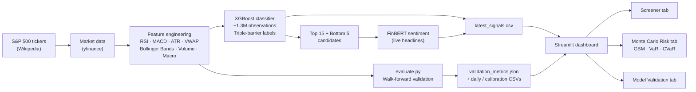

# S&P 500 stock screener

[](https://github.com/ethanbuckley/stockmarketS-P/actions/workflows/ci.yml)

A two-stage pipeline that ranks long and short candidates across the S&P 500: an XGBoost classifier does the ranking, and FinBERT scores news sentiment on the shortlist. The classifier is walk-forward validated, and the dashboard includes a Monte Carlo portfolio-risk simulator.

Built as an independent project applying quantitative finance techniques alongside my Physics and Physical Chemistry degree at UCL.

---

## Live Demo

**[Launch the dashboard →](https://stockmarkets-p-cngwhp4eigfgpq5xphgwng.streamlit.app)**

---

## Architecture


```mermaid
flowchart LR
    A["S&P 500 tickers\n(Wikipedia)"] --> B["Market data\n(yfinance)"]
    B --> C["Feature engineering\nRSI · MACD · ATR · VWAP\nBollinger Bands · Volume · Macro"]
    C --> D["XGBoost classifier\n~1.3M observations\nTriple-barrier labels"]
    D --> E["Top 15 + Bottom 5\ncandidates"]
    E --> F["FinBERT sentiment\n(live headlines)"]
    D & F --> G["latest_signals.csv"]
    C --> V["evaluate.py\nWalk-forward validation"]
    V --> M["validation_metrics.json\n+ daily / calibration CSVs"]
    G --> H["Streamlit dashboard"]
    M --> H
    H --> I["Screener tab"]
    H --> J["Monte Carlo Risk tab\nGBM · VaR · CVaR"]
    H --> K["Model Validation tab"]
```

---

## How It Works

### Stage 1: XGBoost classifier

An XGBoost binary classifier is trained on 10+ years of daily OHLCV data across all S&P 500 constituents (roughly 1.3 million daily observations, 2015 to present). The target variable uses **triple-barrier labelling**: for each trading day, the label asks whether the stock hits a +4% take-profit before a −4% stop-loss within the next 5 trading days. This is preferable to simple forward returns because it reflects how a real trade with risk management plays out. Days where neither barrier is hit, or where both are hit on the same bar, are conservatively labelled 0.

Features fall into five groups (22 columns in total):

| Group                | Features                                  |
| -------------------- | ----------------------------------------- |
| Momentum             | RSI, MACD, lagged returns                 |
| Volatility           | Bollinger Band position, ATR ratio        |
| Volume               | Volume surge, VWAP deviation              |
| Market context       | SPY, QQQ, SMH returns; VIX, 10Y Treasury  |
| Relative performance | Stock return vs each macro benchmark      |

One model is trained across all tickers rather than one per stock, so the classifier learns patterns that generalise across the market rather than fitting to individual ticker history.

### Stage 2: FinBERT sentiment analysis

The top 15 and bottom 5 candidates by XGBoost confidence are passed to **FinBERT** ([ProsusAI/finbert](https://huggingface.co/ProsusAI/finbert)), a BERT model fine-tuned on financial news, analyst reports, and earnings call transcripts. Live news headlines are fetched for each candidate and scored; positive, negative and neutral labels map to +score, −score and 0, and the final sentiment is the mean over up to 10 headlines. A blank sentiment score means no news was available, which is deliberately distinct from a neutral score of 0.

### Monte Carlo portfolio risk

The dashboard's risk tab simulates thousands of future paths for an equal-weighted portfolio of screener candidates using geometric Brownian motion calibrated to one year of historical daily log-returns. Co-movement between assets is preserved by Cholesky-decomposing the empirical correlation matrix and correlating the random shocks accordingly. The tab reports 95% VaR and CVaR (expected shortfall), the probability of loss, a fan chart of simulated paths, and the distribution of final portfolio values, together with the model's assumptions and their limitations.

---

## Validation

The classifier is evaluated with **expanding-window walk-forward validation** (`evaluate.py`): seven folds with calendar-year test blocks from 2020 to a partial 2026, each retraining the production model from scratch on all data up to that fold. Because the label looks 5 trading days ahead, the last 5 trading days before each test block are purged from training; features are strictly backward-looking, which an automated causality check enforces. Two leakage canaries back this up: training on permuted labels gives a test AUC of 0.52 (chance), and removing the purge produces no measurable advantage on the earliest test days.

Headline out-of-sample results (2026-07-03 data snapshot, 503 tickers, 806,246 test rows over 1,630 test days; all figures computed by `evaluate.py` and stored in [`data/validation_metrics.json`](data/validation_metrics.json)):

| Metric                              | Value                                     |
| ----------------------------------- | ----------------------------------------- |
| ROC AUC (pooled)                    | 0.655                                     |
| Brier score                         | 0.197                                     |
| Precision@top-15, daily mean        | 48.1% vs a 29.4% daily base rate          |
| Excess over base rate               | +18.7 pts (95% CI +17.2 to +20.1)         |
| Days the top-15 beats the base rate | 79.7% of 1,630 test days                  |
| Top-decile lift                     | 1.79x mean (1.67x median)                 |
| Bottom-5 positive rate              | 11.4% vs the 29.4% base rate              |

Precision@top-15 mirrors deployment: each test day, rank the whole cross-section by predicted probability, take the top 15, and measure the fraction whose take-profit barrier was hit first. Per fold:

| Test year      | ROC AUC | Precision@15 | Base rate |
| -------------- | ------- | ------------ | --------- |
| 2020           | 0.641   | 50.6%        | 37.3%     |
| 2021           | 0.674   | 46.8%        | 26.5%     |
| 2022           | 0.618   | 45.6%        | 32.9%     |
| 2023           | 0.655   | 48.7%        | 25.2%     |
| 2024           | 0.652   | 46.6%        | 24.7%     |
| 2025           | 0.648   | 49.7%        | 27.9%     |
| 2026 (partial) | 0.602   | 49.5%        | 33.6%     |

The ranking beats the base rate in every regime tested (the 2020 crash, the 2022 bear market, and the recoveries either side), but these are classifier-quality metrics with an important caveat: the universe is **today's** S&P 500 constituents applied retroactively, so the measured hit rates are optimistic (see Limitations). The dashboard's Model Validation tab renders these artefacts, including per-day dispersion and the calibration curve.

Interpretation thresholds used by the screener:

| Signal          | Condition                                |
| --------------- | ---------------------------------------- |
| Long candidate  | Confidence > 55% **and** Sentiment > 0   |
| Short candidate | Confidence < 45% **and** Sentiment < 0   |

---

## Limitations

Read these before quoting any number above; the validation caveats among them also ship inside `data/validation_metrics.json`, so the dashboard cannot display the metrics without them.

- **Survivorship bias.** The universe is the current S&P 500 membership scraped from Wikipedia and applied back to 2015. Companies that were removed from the index along the way are missing, which inflates measured hit rates. Historical constituent lists are not freely available, so this is documented rather than corrected.
- **No transaction costs or portfolio backtest.** The validation measures per-prediction classifier quality, not tradeable returns. No costs, slippage, sizing or capacity effects are modelled.
- **Data quality.** Prices are a single yfinance snapshot with auto-adjustment applied at download time; adjusted history can differ from what was observable in real time, and delisted tickers are absent.
- **Label conventions.** "Neither barrier hit" and "both barriers hit on the same bar" both map to label 0, so the class balance depends on the volatility regime (daily base rates ranged from 24.7% to 37.3% across test years). A low predicted probability is therefore not a symmetric short signal.
- **Overlapping labels.** Consecutive test days share 5-day label windows and are not independent; the confidence interval above uses a moving-block bootstrap with block length 5.
- **Sentiment coverage.** Some candidates have no recent headlines; their sentiment is blank, not zero.
- **Risk-tab assumptions.** Geometric Brownian motion assumes constant drift and volatility, normal shocks and static correlations, all violated by real equity returns (correlations in particular spike in crashes). The in-app methodology notes cover this in detail.

---

## Tech Stack

| Component           | Technology                                        |
| ------------------- | ------------------------------------------------- |
| ML classifier       | XGBoost                                           |
| NLP sentiment       | FinBERT (ProsusAI/finbert, HuggingFace Transformers) |
| Validation          | Walk-forward evaluation (scikit-learn metrics)    |
| Risk simulation     | NumPy (geometric Brownian motion, Cholesky)       |
| Data acquisition    | yfinance, requests                                |
| Feature engineering | pandas, NumPy                                     |
| Dashboard           | Streamlit, Plotly                                 |
| Universe            | S&P 500 (scraped live from Wikipedia)             |

---

## Project Structure

```
stockmarketS-P/
├── screener.py             # Pipeline: data → features → labels → XGBoost → FinBERT
├── generate_signals.py     # Runs the pipeline and writes data/latest_signals.csv
├── evaluate.py             # Walk-forward validation; writes the validation artefacts
├── app.py                  # Streamlit dashboard: reads committed CSVs/JSON only
├── data/
│   ├── latest_signals.csv          # Pre-computed signals for the live demo
│   ├── validation_metrics.json     # Headline metrics, fold table, caveats, snapshot
│   ├── validation_daily.csv        # One row per out-of-sample test day
│   └── validation_calibration.csv  # Reliability-curve bins
├── tests/                  # Network-free unit tests (labels, features, sentiment, folds)
├── .github/workflows/ci.yml  # Lint + tests on every push
├── requirements.txt        # App-only dependencies (Streamlit Community Cloud)
├── requirements-full.txt   # Full pipeline: xgboost, transformers, torch, scikit-learn
├── requirements-dev.txt    # pytest, ruff, xgboost, scikit-learn
├── pyproject.toml          # Ruff and pytest configuration
└── README.md
```

**`screener.py`** holds the entire pipeline as importable functions; `generate_signals.py` and `evaluate.py` are thin entry points over it, so the deployed signals and the validation can never drift apart.

**`app.py`** reads only the committed artefacts; it does not import XGBoost, Transformers or PyTorch, so it runs on Streamlit Community Cloud's free tier.

---

## Running Locally

### Full pipeline (data fetching + model training + FinBERT)

```bash
git clone https://github.com/ethanbuckley/stockmarketS-P.git
cd stockmarketS-P
pip install -r requirements-full.txt
python screener.py          # live console output
python generate_signals.py  # also writes data/latest_signals.csv
```

On first run, FinBERT downloads automatically (~400 MB). Subsequent runs load from cache. A full run takes roughly 15 to 30 minutes depending on internet speed and hardware; for a minutes-long smoke run of the whole path, use:

```bash
python screener.py --tickers-limit 25 --skip-sentiment
```

### Walk-forward validation

```bash
python evaluate.py --cache master_cache.pkl --shuffled-target-check --purge-ablation
```

This regenerates the three `data/validation_*` artefacts from a fresh data snapshot. The cache flag pickles the labelled panel locally so re-runs skip the download; the two check flags run the leakage canaries described above.

### Dashboard only

```bash
pip install -r requirements.txt
streamlit run app.py
```

The dashboard reads `data/latest_signals.csv` and the validation artefacts. If the signals file is missing, run `generate_signals.py` first (or use the committed sample file).

### Development

```bash
pip install -r requirements-dev.txt
ruff check .
pytest
```

The test suite is network-free and runs in a few seconds; CI runs the same two commands on every push.

---

## Disclaimer

This project is for educational and research purposes only. It does not constitute financial advice. Past model performance does not guarantee future results.

---

## Author

Ethan Buckley, MSci Natural Sciences (Physics and Physical Chemistry), UCL
[ethan@ethanbuckley.me.uk](mailto:ethan@ethanbuckley.me.uk)

Released under the [MIT licence](LICENSE).
