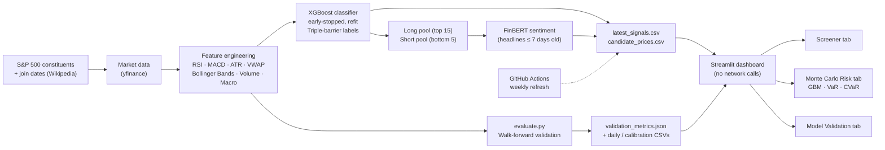

# S&P 500 stock screener

[](https://github.com/ethanbuckley/stockmarketS-P/actions/workflows/ci.yml)

A two-stage pipeline that ranks long and short candidates across the S&P 500: an XGBoost classifier does the ranking, and FinBERT scores news sentiment on the shortlist. The classifier is walk-forward validated, and the dashboard includes a Monte Carlo portfolio-risk simulator.

Built as an independent project applying quantitative finance techniques alongside my Physics and Physical Chemistry degree at UCL.

---

## Live Demo

**[Launch the dashboard →](https://stockmarkets-p-cngwhp4eigfgpq5xphgwng.streamlit.app)**

---

## Architecture


```mermaid
flowchart LR
    A["S&P 500 constituents\n+ join dates (Wikipedia)"] --> B["Market data\n(yfinance)"]
    B --> C["Feature engineering\nRSI · MACD · ATR · VWAP\nBollinger Bands · Volume · Macro"]
    C --> D["XGBoost classifier\nearly-stopped, refit\nTriple-barrier labels"]
    D --> E["Long pool (top 15)\nShort pool (bottom 5)"]
    E --> F["FinBERT sentiment\n(headlines ≤ 7 days old)"]
    D & F --> G["latest_signals.csv\ncandidate_prices.csv"]
    C --> V["evaluate.py\nWalk-forward validation"]
    V --> M["validation_metrics.json\n+ daily / calibration CSVs"]
    W["GitHub Actions\nweekly refresh"] -.-> G
    G --> H["Streamlit dashboard\n(no network calls)"]
    M --> H
    H --> I["Screener tab"]
    H --> J["Monte Carlo Risk tab\nGBM · VaR · CVaR"]
    H --> K["Model Validation tab"]
```

---

## How It Works

### Stage 1: XGBoost classifier

An XGBoost binary classifier is trained on daily OHLCV data for the current S&P 500 constituents from 2015 to the present. Each company enters the panel only from the date it joined the index (the Wikipedia constituents table records this), so no pre-membership history is trained on; indicator windows are still warmed up on the earlier prices, which did exist. The target variable uses **triple-barrier labelling**: for each trading day, the label asks whether the stock hits a +4% take-profit before a −4% stop-loss within the next 5 trading days. This is preferable to simple forward returns because it reflects how a real trade with risk management plays out. Days where neither barrier is hit, or where both are hit on the same bar, are conservatively labelled 0.

Features fall into five groups (22 columns in total):

| Group                | Features                                  |
| -------------------- | ----------------------------------------- |
| Momentum             | RSI, MACD, lagged returns                 |
| Volatility           | Bollinger Band position, ATR ratio        |
| Volume               | Volume surge, VWAP deviation              |
| Market context       | SPY, QQQ, SMH returns; VIX, 10Y Treasury  |
| Relative performance | Stock return vs each macro benchmark      |

One model is trained across all tickers rather than one per stock, so the classifier learns patterns that generalise across the market rather than fitting to individual ticker history. The number of boosting rounds is not fixed: `train_model` holds out the most recent 10% of training dates (with the same 5-day purge the validation uses), early-stops against that slice, then refits on all training rows with the chosen count. All tunable settings live in `config.py`.

### Stage 2: FinBERT sentiment analysis

The top 15 (long pool) and bottom 5 (short pool) candidates by XGBoost confidence are passed to **FinBERT** ([ProsusAI/finbert](https://huggingface.co/ProsusAI/finbert)), a BERT model fine-tuned on financial news, analyst reports, and earnings call transcripts. Headlines published within the last 7 days are fetched for each candidate and scored; positive, negative and neutral labels map to +score, −score and 0, and the final sentiment is the mean over up to 10 headlines. A blank sentiment score means no recent news was available, which is deliberately distinct from a neutral score of 0.

Signals are rank-based. A long candidate is a stock in the long pool with positive sentiment; a short candidate is one in the short pool with negative sentiment. There is no absolute confidence cut-off: the label is positive for only about a quarter to a third of stock-days, so a well-calibrated probability near 50% is already roughly twice the base rate, and a 55% cut-off (an earlier version of this project) was effectively never reached.

### Monte Carlo portfolio risk

The dashboard's risk tab simulates thousands of future paths for an equal-weighted portfolio of screener candidates using geometric Brownian motion calibrated to one year of historical daily log-returns. That year of adjusted closes is written next to the signals as `data/candidate_prices.csv`, so the deployed app never calls Yahoo. Co-movement between assets is preserved by Cholesky-decomposing the empirical correlation matrix and correlating the random shocks accordingly. The tab reports 95% VaR and CVaR (expected shortfall), the probability of loss, a fan chart of simulated paths, and the distribution of final portfolio values, together with the model's assumptions and their limitations.

---

## Validation

The classifier is evaluated with **expanding-window walk-forward validation** (`evaluate.py`): 7 folds with calendar-year test blocks from 2020 to a partial 2026, each retraining the production model from scratch on all data up to that fold, including the early-stopping choice of tree count, which uses only that fold's training data. Because the label looks 5 trading days ahead, the last 5 trading days before each test block are purged from training; features are strictly backward-looking, which an automated causality check enforces. Two leakage canaries back this up. Training fold 1 on permuted labels gives test AUCs between 0.46 and 0.53 across five permutations, against 0.65 with the real labels; the spread is wide because the macro features are identical for every ticker on a given day, so a noise-fit model's effective sample is the number of test days rather than rows, and only an upward deviation would indicate leakage. Removing the purge gives the unpurged model a 0.007 AUC advantage on the first ten test days (0.580 against 0.573), which is the boundary leakage the purge exists to remove.

Headline out-of-sample results (2026-09-11 data snapshot, 502 tickers, 740,263 test rows over 1,659 test days; all figures computed by `evaluate.py` and stored in [`data/validation_metrics.json`](data/validation_metrics.json)):

| Metric                              | Value                                     |
| ----------------------------------- | ----------------------------------------- |
| ROC AUC (pooled)                    | 0.661                                     |
| Brier score                         | 0.191                                     |
| Precision@top-15, daily mean        | 45.9% vs a 28.4% daily base rate          |
| Excess over base rate               | +17.5 pts (95% CI +16.2 to +18.8)         |
| Days the top-15 beats the base rate | 79.0% of 1,659 test days                  |
| Top-decile lift                     | 1.77x mean (1.62x median)                 |
| Bottom-5 positive rate              | 10.8% vs the 28.4% base rate              |

Precision@top-15 mirrors deployment: each test day, rank the whole cross-section by predicted probability, take the top 15, and measure the fraction whose take-profit barrier was hit first. Per fold (trees = boosting rounds chosen by early stopping inside that fold's training data):

| Test year      | Trees | ROC AUC | Precision@15 | Base rate |
| -------------- | ----- | ------- | ------------ | --------- |
| 2020           |    68 | 0.651   | 46.4%        | 36.1%     |
| 2021           |    59 | 0.684   | 45.3%        | 25.3%     |
| 2022           |    72 | 0.629   | 45.7%        | 31.9%     |
| 2023           |    58 | 0.652   | 44.0%        | 23.9%     |
| 2024           |    36 | 0.654   | 44.9%        | 23.5%     |
| 2025           |    44 | 0.655   | 47.3%        | 27.3%     |
| 2026 (partial) |    55 | 0.623   | 48.9%        | 32.6%     |

The ranking beats the base rate in every regime tested (the 2020 crash, the 2022 bear market, and the recoveries either side), but these are classifier-quality metrics with an important caveat: the universe is **today's** S&P 500 constituents, each included only from its join date (188 of 502 joined after 2015). Companies removed from the index since 2015 are absent, so the measured hit rates are optimistic (see Limitations). The dashboard's Model Validation tab renders these artefacts, including per-day dispersion and the calibration curve.

Signal definitions used by the screener and dashboard:

| Signal          | Condition                                              |
| --------------- | ------------------------------------------------------ |
| Long candidate  | In the long pool (top 15 by confidence) **and** Sentiment > 0 |
| Short candidate | In the short pool (bottom 5 by confidence) **and** Sentiment < 0 |

---

## Limitations

Read these before quoting any number above; the validation caveats among them also ship inside `data/validation_metrics.json`, so the dashboard cannot display the metrics without them.

- **Survivorship bias.** The universe is the current S&P 500 membership scraped from Wikipedia. Each ticker enters the panel from its recorded join date, so backfilled pre-membership history is not used. Companies that were removed from the index since 2015 are still missing, and that half of the bias inflates measured hit rates; correcting it needs point-in-time membership and price data for delisted names, which this project does not have.
- **No transaction costs or portfolio backtest.** The validation measures per-prediction classifier quality, not tradeable returns. No costs, slippage, sizing or capacity effects are modelled.
- **Data quality.** Prices are a single yfinance snapshot with auto-adjustment applied at download time; adjusted history can differ from what was observable in real time, and delisted tickers are absent. Prices are forward-filled across a ticker's non-trading days so macro series align; volume is not, so those days carry no training row.
- **Label conventions.** "Neither barrier hit" and "both barriers hit on the same bar" both map to label 0, so the class balance depends on the volatility regime (daily base rates ranged from 23.5% to 36.1% across test years). A low predicted probability is therefore not a symmetric short signal.
- **Overlapping labels.** Consecutive test days share 5-day label windows and are not independent; the confidence interval above uses a moving-block bootstrap with block length 5.
- **Sentiment coverage.** Some candidates have no headlines from the last 7 days; their sentiment is blank, not zero.
- **Risk-tab assumptions.** Geometric Brownian motion assumes constant drift and volatility, normal shocks and static correlations, all violated by real equity returns (correlations in particular spike in crashes). The in-app methodology notes cover this in detail.

---

## Tech Stack

| Component           | Technology                                        |
| ------------------- | ------------------------------------------------- |
| ML classifier       | XGBoost                                           |
| NLP sentiment       | FinBERT (ProsusAI/finbert, HuggingFace Transformers) |
| Validation          | Walk-forward evaluation (scikit-learn metrics)    |
| Risk simulation     | NumPy (geometric Brownian motion, Cholesky)       |
| Data acquisition    | yfinance, requests (pipeline only)                |
| Feature engineering | pandas, NumPy                                     |
| Dashboard           | Streamlit, Plotly; reads committed files, no network |
| Universe            | S&P 500 with join dates (scraped from Wikipedia)  |
| Automation          | GitHub Actions: CI on push, weekly signal refresh |

---

## Project Structure

```
stockmarketS-P/
├── config.py               # Shared settings and paths (dependency-free)
├── screener.py             # Pipeline: data → features → labels → XGBoost → FinBERT
├── generate_signals.py     # Runs the pipeline; writes latest_signals.csv + candidate_prices.csv
├── evaluate.py             # Walk-forward validation; writes the validation artefacts
├── app.py                  # Streamlit dashboard: reads committed CSVs/JSON only
├── data/
│   ├── latest_signals.csv          # Pre-computed signals for the live demo
│   ├── candidate_prices.csv        # One year of adjusted closes for the candidates
│   ├── validation_metrics.json     # Headline metrics, fold table, caveats, snapshot
│   ├── validation_daily.csv        # One row per out-of-sample test day
│   └── validation_calibration.csv  # Reliability-curve bins
├── tests/                  # Network-free unit tests (labels, features, sentiment, folds)
├── .github/workflows/
│   ├── ci.yml                  # Lint, format check and tests on every push
│   └── refresh-signals.yml     # Weekly: regenerate and commit the two signal files
├── requirements.txt        # App-only dependencies (Streamlit Community Cloud)
├── requirements-full.txt   # Full pipeline: xgboost, transformers, torch, scikit-learn
├── requirements-dev.txt    # pytest, ruff, xgboost, scikit-learn
├── pyproject.toml          # Ruff and pytest configuration
└── README.md
```

**`screener.py`** holds the entire pipeline as importable functions; `generate_signals.py` and `evaluate.py` are thin entry points over it, so the deployed signals and the validation can never drift apart. **`config.py`** holds every tunable setting and file path.

**`app.py`** reads only the committed artefacts and imports only `config.py` from the project; it does not import XGBoost, Transformers, PyTorch or yfinance, makes no network calls, and runs on Streamlit Community Cloud's free tier.

---

## Running Locally

### Full pipeline (data fetching + model training + FinBERT)

```bash
git clone https://github.com/ethanbuckley/stockmarketS-P.git
cd stockmarketS-P
pip install -r requirements-full.txt
python screener.py          # live console output
python generate_signals.py  # also writes data/latest_signals.csv and data/candidate_prices.csv
```

On first run, FinBERT downloads automatically (~400 MB). Subsequent runs load from cache. A full run takes roughly 15 to 30 minutes depending on internet speed and hardware; for a minutes-long smoke run of the whole path, use:

```bash
python screener.py --tickers-limit 25 --skip-sentiment
```

### Walk-forward validation

```bash
python evaluate.py --cache master_cache.pkl --shuffled-target-check --purge-ablation
```

This regenerates the three `data/validation_*` artefacts from a fresh data snapshot. The cache flag pickles the labelled panel locally so re-runs skip the download; the two check flags run the leakage canaries described above.

### Weekly refresh (GitHub Actions)

`.github/workflows/refresh-signals.yml` runs `generate_signals.py` every Friday after the US close and commits the two signal files if they changed. It installs CPU-only PyTorch and caches the FinBERT weights, so a run takes well under the job's two-hour limit. Trigger it by hand from the Actions tab with "Run workflow".

### Dashboard only

```bash
pip install -r requirements.txt
streamlit run app.py
```

The dashboard reads `data/latest_signals.csv`, `data/candidate_prices.csv` and the validation artefacts. If the signal files are missing, run `generate_signals.py` first (or use the committed files).

### Development

```bash
pip install -r requirements-dev.txt
ruff check .
ruff format --check .
pytest
```

The test suite is network-free and runs in a few seconds; CI runs the same three commands on every push.

---

## Disclaimer

This project is for educational and research purposes only. It does not constitute financial advice. Past model performance does not guarantee future results.

---

## Author

Ethan Buckley, MSci Natural Sciences (Physics and Physical Chemistry), UCL
[ethan@ethanbuckley.me.uk](mailto:ethan@ethanbuckley.me.uk)

Released under the [MIT licence](LICENSE).
